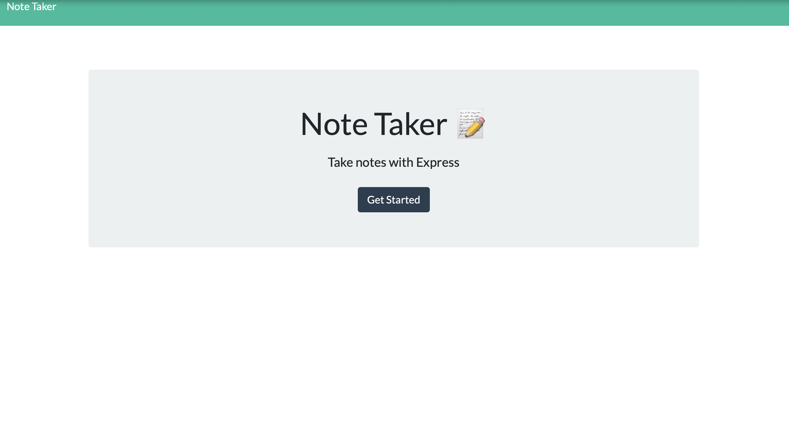
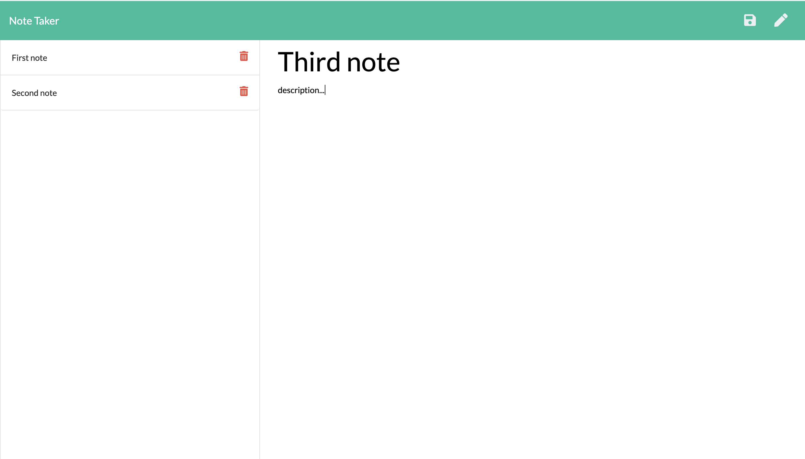

# NotePad

```
Write, save, and delete notes with this application.
```

### [Link to application](https://intense-sea-80554.herokuapp.com)

## Description

```
Keep track of your thoughts using this notepad
Save, view and delete recent notes easily 
```

## How it works

```
Using express, notes created by the user will be stored into a database with a GET request, then rendered to the page with a POST request once it is saved. To delete a note, click on the trash can icon next to the note.
```






